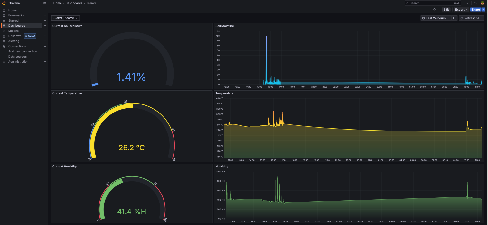

# Grafana – Dashboard

Grafana visualizes temperature, humidity and soil moisture time-series-data. It sends a request to the InfluxDB to fetch the data.

## Features

- Connects to InfluxDB as a data source
- Displays real-time temperature, humidity and soil moisture graphs